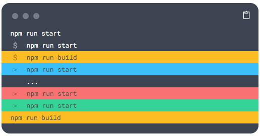

# 介绍

# 说明

## 插件说明

### TAB制表符插件

#### · 安装

```html
<script src="https://cdn.jsdelivr.net/npm/docsify@4"></script>
```

#### · 使用

```shell
<!-- tabs:start -->

#### **English**

Hello!

#### **French**

Bonjour!

#### **Italian**

Ciao!

<!-- tabs:end -->

```

#### · 配置

```js
window.$docsify = {
  // ...
  tabs: {
    // 确定在页面刷新/重新访问后是否还原选项卡选择。
    persist: true,
    // 确定选项卡选择是否在具有匹配标签的选项卡之间同步。
    sync: true,
    // 设置选项卡主题。值 will 指示不应应用任何主题，在创建自定义选项卡主题时应使用该主题。
    theme: 'classic',
    // 确定是否可以使用制表符注释来定义制表符集中的制表符。
    tabComments: true,
    // 确定是否可以使用标题 + 粗体 Markdown 定义选项卡集中的选项卡。
    tabHeadings: true
  }
};

```

### 字数统计

#### · 安装

```html
<script src="https://cdn.jsdelivr.net/npm/docsify-count@latest/dist/countable.min.js"></script>
```

#### · 使用

```shell
# 无
```

#### · 配置

```js
window.$docsify = {
  count:{
    // 设置字符统计展示与否(true/false)
    countable: true,
    // 设置展示位置(top/bottom)
    position: 'top',
    // 设置与邻近DOM的距离
    margin: '10px',
    // 设置元素对齐(right/top)
    float: 'right',
    // 设置字体大小
    fontsize:'0.9em',
    // 设置颜色
    color:'rgb(90,90,90)',
    // 设置语言(english/chinese)
    language:'chinese',
    // 支持翻译
    localization: {
      words: "",
      minute: ""
    },
    // 是否显示预计阅读时长(true/false)
    isExpected: true
  }
}
```

### 代码块复制粘贴板

#### · 安装

```html
<script src="https://unpkg.com/docsify-copy-code"></script>
```

#### · 使用

```shell
# 无
```

#### · 配置

```js
window.$docsify = {
  copyCode: {
    buttonText: {
      '/zh-cn/': '点击复制',
      '/ru/': 'Скопировать в буфер обмена',
      '/de-de/': 'Klicken Sie zum Kopieren',
      '/es/': 'Haga clic para copiar',
      '/': 'Copy to clipboard',
    },
    errorText: {
      '/zh-cn/': '错误',
      '/ru/': 'ошибка',
      '/': 'Error',
    },
    successText: {
      '/zh-cn/': '复制',
      '/ru/': 'Скопировано',
      '/de-de/': 'Kopiert',
      '/es/': 'Copiado',
      '/': 'Copied',
    },
  },
};
```

### 顶部横幅插件

#### · 安装

```html
<!-- 头部添加 -->
<link
  rel="stylesheet"
  href="//cdn.jsdelivr.net/npm/docsify-top-banner-plugin@latest/dist/style.css"
/>
<!-- 底部添加 -->
<script src="https://cdn.jsdelivr.net/npm/docsify-top-banner-plugin@latest/dist/index.js"></script>
```

#### · 使用

```shell
# 无
```

#### · 配置

```js
window.$docsify = {
  // ...
  topBanner: {
    // 横幅内容(PS: 它应该是单行内容,不能是空的！留空只会呈现一个空横幅)
    content: "",
    // HTML 标记，该标记将添加到 DOM 中以呈现横幅
    defaultTag: "span",
    // 这是横幅的 CSS 属性
    position: "fixed",
    // 横幅的背景色
    backgroundColor: "#deebff",
    // 横幅的z-index(PS: 当你在docsify中有repo config时，使用position和=relativezIndex-1)
    zIndex: "99",
    // 横幅的主要文本颜色
    textColor: "#091E42",
    // 横幅内锚标记的主要文本颜色
    linkColor: "value of textColor",
    // 横幅内容的对齐方式
    textAlign: "center",
  },
  // ...
}
```

### 阅读进度条

#### · 安装

```html
<script src="https://cdn.jsdelivr.net/npm/docsify-progress@latest/dist/progress.min.js"></script>
```

#### · 使用

```shell
# 无
```

#### · 配置

```js
window.$docsify = {
  // ...
  progress: {
    // 位置(top/bottom)
    position: "top",
    // 颜色
    color: "var(--theme-color,#42b983)",
    // 高度
    height: "3px",
  }
}
```

### 聊天记录插件


#### · 安装

```html
<script src="//cdn.jsdelivr.net/npm/docsify-chat/lib/docsify-chat.min.js"></script>
```

#### · 使用

```shell
<!-- chat:start -->
#### **kokkoro**
八嘎 hentai 无路赛！
#### **yuki**
多来点
<!-- chat:end -->
```

#### · 配置

```js
window.$docsify = {
  // ...
  chat: {
    // chat panel title
    title: '聊天记录',
    // set avatar url
    users: [
      { nickname: 'yuki', avatar: 'images/yuki.png' },
      { nickname: 'kokkoro', avatar: 'images/kokkoro.png' },
    ],
    // message dialog on the right (myself)
    myself: 'yuki',
    // animation interval (ms)
    animation: 50,
    // Panel navigation bar style, supporting "mac" and "windows"
    os: 'mac',
  }
};
```

### 漂亮的终端块


#### · 安装

```html
<script src="https://cdn.jsdelivr.net/npm/docsify-terminal-block@1.0.3"></script>  
```

#### · 使用

```shell
```terminal
npm run start
$|npm run start
$|warning|npm run build
>|info|npm run start
  |...
>|error|npm run start
>|success|npm run start
warning|npm run build
```                                       (PS:这里是占位符)
```

#### · 配置

```js
// 无
```

## 目录说明

```shell

./          # 当前目录
├─.github               # 文件夹：GitHub相关的配置文件
│  ├─ISSUE_TEMPLATE             # 文件夹：GitHub的ISSUE模板配置器文件储存地方
│  │  ├─bug_report.md                   # 文件：Github使用Bug报告模板(可由GitHub中项目的community里面进行生成/更改)
│  │  ├─config.yml                      # 文件：issue配置文件
│  │  └─feature_request.md              # 文件：Github使用功能请求模板(可由GitHub中项目的community里面进行生成/更改)
│  ├─dependabot.yml             # 文件：Node.js的依赖机器人(由GitHub自动拉取更新)
│  ├─README.md                  # 文件：GitHub仓库说明/介绍文档
│  └─pull_request_template.md   # 文件：Github使用拉取请求模板
├─docs                  # 文件夹：文档文件
│  ├─index.html                 # 文件：主加载解析文件(PS：所有的插件/主题/JS/解析等内容都需要从这里走)
│  └─README.md                  # 文件：主显示文档(PS：你可以理解成首页)
├─src                   # 文件夹：源码文件
├─packages              # 文件夹：备份打包文件
├─test                  # 文件夹：测试文件
├─build                 # 文件夹：打包发布文件
├─.gitignore            # 文件：告诉git不要上传到 GitHub上的文件，可以是单个文件也可以是目录
├─CODE_OF_CONDUCT.md    # 文件：行为准则文件（说明可以干什么什么不可以干）
├─CONTRIBUTING.md       # 文件：贡献准则文件（说明贡献要求以及规范等）
├─CHANGELOG.md          # 文件：更新日志文件（说明每次更新了什么内容以及修复了什么BUG等）
├─LICENSE               # 文件：授权协议
├─SECURITY.md           # 文件：安全策略文件（说明安全漏洞等）
└─README.md             # 文件：自述文件，整个项目的简介、使用方法等

```

# 其他